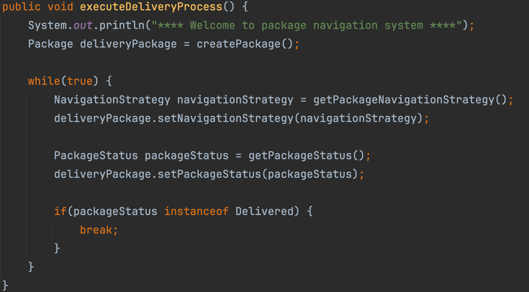

# گزارش آزمایش
برای پیاده سازی وضعیت بسته از الگوی state استفاده کردیم. ابتدا یک interface با نام PackageStatus ایجاد شد که تنها یک تابع printStatus دارد. سپس دو کلاس Delivered و InTransit ساخته شد که این interface را پیاده سازی می‌کنند و وضعیت‌های مختلف بسته را نشان می‌دهند. در ادامه فیلد packageStatus را به کلاس Package اضافه می‌کنیم که وضعیت بسته را نشان می‌دهد و از نوع PackageStatus است. به این صورت الگوی state محقق می‌شود و اجازه می‌دهیم یک object از کلاس Package وضعیت خود را تغییر دهد و در پی آن رفتارش نیز تغییر کند.

برای پیاده سازی روش جابجایی بسته و الگوریتم‌های مختلف قیمت گذاری از الگوی Strategy استفاده می‌کنیم. ابتدا یک interface با نام NavigationStrategy ایجاد شد که شامل تابع calculateNavigationPrice است. سپس دو کلاس با نام‌های ExpressNavigation و StandardNavigation ساخته شد که این interface را پیاده سازی می‌کنند و هر کدام الگوریتم قیمت دهی مربوط به خود را در تابع calculateNavigationPrice دارند. در ادامه فیلد navigationStrategy را به کلاس Package اضافه میکنیم که روش جابجایی بسته را نشان می‌دهد و از نوع NavigationStrategy است. به این صورت الگوی Strategy محقق می‌شود و هر الگوریتم یا استراتژی قیمت دهی(شامل express و standard) را در یک کلاس جداگانه قرار داده‌ایم و هر package رفرنسی به یکی از این استراتژی‌ها دارد که وظیفه قیمت دهی را به آن delegate می‌کند.

همانطور که اشاره شد باید فیلدهای مربوط به وضعیت بسته و نحوه جابجایی آن را به کلاس Package اضافه کنیم.

مطابق خواسته دستورکار ابتدا وزن بسته به عنوان ورودی گرفته می‌شود و با آن یک object از کلاس Package ساخته می‌شود. سپس در یک حلقه روش ارسال و سپس وضعیت بسته دریافت می‌شود. اینکار را تا جایی ادامه می‌دهیم که بسته به مقصد نرسیده باشد. در این حلقه امکان تغییر وضعیت بسته و نحوه جابجایی وجود دارد و پس از هر بار تغییر پیام مربوطه چاپ می‌شود.

نمونه‌ خروجی برنامه:

تمام مراحل پیاده سازی از روش TDD استفاده شده است. به این صورت که ابتدا تست مربوط به عملکرد نوشته شده است و سپس functionality مربوطه پیاده سازی شده است تا تست‌ها را پاس کند. در ادامه نیز تلاش شد تا خوانایی کد تا حد امکان بهتر شود.
